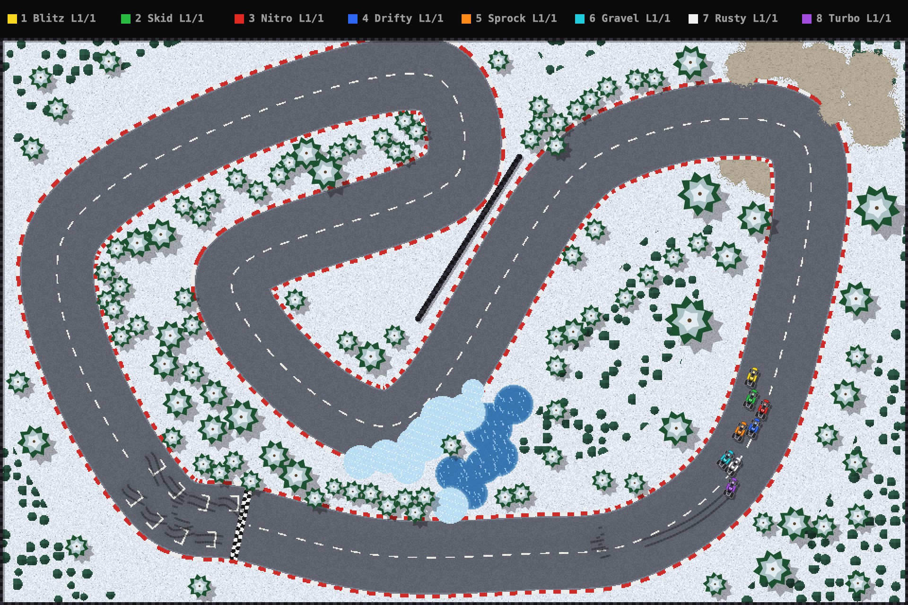
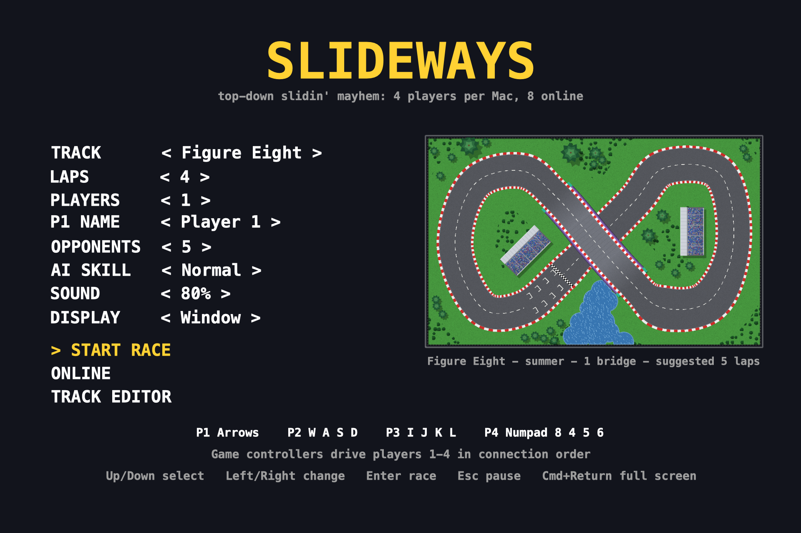
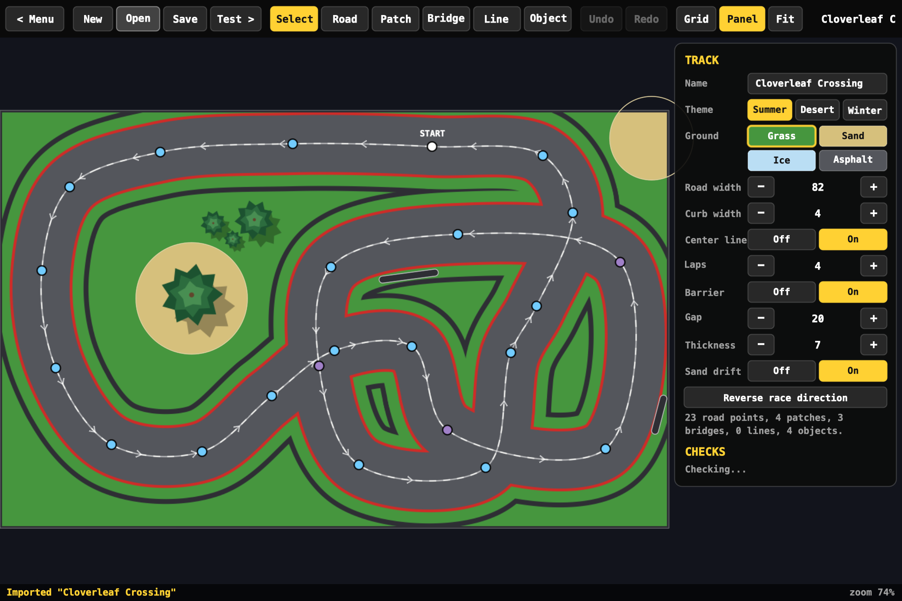

# Slideways

Top-down arcade racing for macOS, with sliding cars, AI opponents, bridges,
local multiplayer, online races, and a built-in track editor.

## Screenshots

### Racing on Pine Ridge



### Race Setup



### Track Editor



## Download and Play

Download the macOS ZIP from [GitHub Releases](https://github.com/ramivalta/slideways/releases/latest),
extract it, and open **Slideways.app**.

- Requires macOS 14 or later.
- The release app supports both Apple Silicon and Intel Macs.
- Builds are ad-hoc signed, not Apple-notarized. macOS may require you to
  approve the app in **System Settings > Privacy & Security** before opening it.

Choose a track, lap count, players, and AI opponents in the main menu. Races
support up to four local players and eight cars total. Speedway is the default
track for new race settings.

## Controls

| Player | Accelerate | Brake | Left | Right |
| --- | --- | --- | --- | --- |
| 1 | Up arrow | Down arrow | Left arrow | Right arrow |
| 2 | W | S | A | D |
| 3 | I | K | J | L |
| 4 | Numpad 8 | Numpad 5 or 2 | Numpad 4 | Numpad 6 |

Compatible game controllers drive local players in connection order. Steer
with the left stick or D-pad, accelerate with the right trigger or A, and
brake with the left trigger, B, or X.

Use arrow keys and Enter to navigate menus. Escape or P opens the race menu;
local races pause, but online races keep running.

## Built-In Tracks

- Speedway
- Pine Ridge
- Quickstep
- Proving Grounds
- Bridge Run
- Cloverleaf
- Cloverleaf Crossing
- Scramble
- Hairpin Valley
- Figure Eight

## Online Racing

Choose **Online > Host a Game** to host. Other players can join a nearby game
or use its code. Online races send the track to participants, so everyone can
race on a custom layout without installing it first. Receiving a track for a
race does not add it to your local track library.

## Relay Server

A relay server helps players join an online race by code when they are on
different networks. The player hosting the race still runs the game; the relay
does not host the race or simulate cars. It lets the host register a room and
lets other players look it up by code. Slideways first tries to connect the
players directly over UDP. If their routers prevent that, the relay forwards
their game packets. Those packets are encrypted end to end, so the relay can
route them but cannot read the join secret or race data.

You do not need a relay for games on the same local network: nearby games are
discovered and joined directly. For internet play, running or using a relay
lets players join by code without configuring port forwarding on the race
host's router. The project provides the relay program, not a hosted relay
service, so use a server address supplied by someone you trust or run one
yourself for your group.

To use a relay, the host and everyone joining by code enter the same server
address in **Online > Relay Server**, such as `relay.example.net` or
`relay.example.net:47810`. The server must be running on a publicly reachable
machine with its UDP port open. GitHub Releases provide a Linux x86_64 archive,
`SlicksRelay-linux-x86_64.tar.gz`; the machine needs compatible Swift 6 runtime
libraries. Pushing a tag publishes the Linux relay alongside the universal
macOS app. Extract the archive and start the server:

```sh
tar -xzf SlicksRelay-linux-x86_64.tar.gz
./SlicksRelay
```

It listens on UDP port 47810 by default; pass a port number to use another one.
If you change the port, include it in the address entered in Slideways. The
relay can also be built from source on macOS or Linux with
`swift build -c release --product SlicksRelay`.

## Custom Tracks

The editor supports road layouts and widths, bridges, surface patches, scenery,
paint lines, and jump ramps. Custom tracks are stored in
`~/Library/Application Support/Slideways/Tracks`.

Export a `.slideways-track` file to share a track. Recipients can open it with
the packaged app or import it from the editor. Imports create new local copies
without overwriting existing tracks.

See [TRACK-SHARING.md](TRACK-SHARING.md) for the export and import workflow,
file format, and validation rules.

## Build From Source

Use macOS 14 or later with a Swift 6 toolchain and the macOS SDK, available
through Xcode. There are no third-party package dependencies.

For a development build:

```sh
swift run SlicksMac
```

Build a release app for this Mac and open it:

```sh
./scripts/build-app.sh --native
open build/Slideways.app
```

Omit `--native` to build a universal Apple Silicon and Intel app:

```sh
./scripts/build-app.sh
```

To try online play with two app instances on one Mac:

```sh
./scripts/play-local.sh
```

Host in one window, then join from the other. Only the focused window receives
keyboard input; controllers can also be used.

## Checks

```sh
swift run SlicksSim --editor
swift run -c release SlicksSim --race-checks
swift run -c release SlicksSim --net
swift run -c release SlicksSim /tmp/slideways-sim
```

The last command runs the simulation checks and AI races, and writes track
renders and audio samples to the output directory. Append a track ID, such as
`speedway`, or a custom track JSON path to restrict the track races.

The full run currently reports bridge-anchor validation failures for Cloverleaf
Crossing and Hairpin Valley, plus grass patches on Hairpin Valley's centerline.
These findings remain even though eight-car races finish with no wrong-level
bridge steps. The editor regression checks pass.

## Code Layout

| Target | Purpose |
| --- | --- |
| SlicksCore | Track definitions, physics, AI, and race rules |
| SlicksGame | SpriteKit presentation, input, audio, menus, and editor |
| SlicksMac | macOS application host |
| SlicksBytes | Shared binary encoding |
| SlicksLink | UDP sockets and relay protocol |
| SlicksNet | Online sessions and race synchronization |
| SlicksRelay | Rendezvous and relay server |
| SlicksSim | Headless simulation and regression checks |